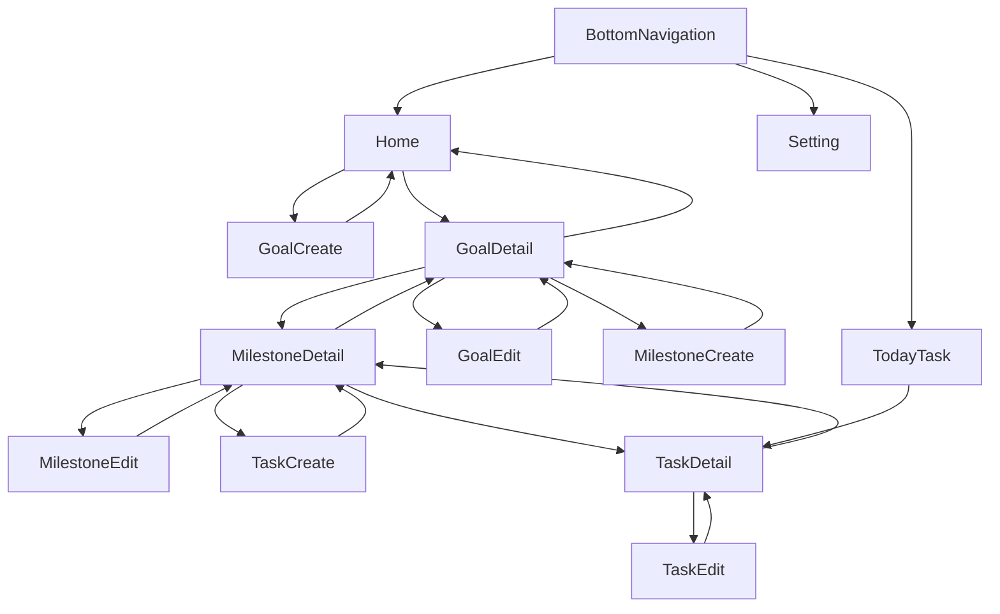

# UI TEST SPEC

エミュレータ / 実機確認用テスト基盤

目的：
実際の操作により

- 仕様通りの体験ができるか
- 想定外の導線が存在しないか
- 実装漏れがないか

を確認する。

---

# 🎯 このドキュメントの役割

テスト担当・開発者・AI が

「何を触れば完成と言えるか」

を共通理解できる状態を作る。

---

---

# 🖥 画面一覧

---

## 1. ゴール一覧（ホーム）

アプリの起点。
ゴール管理の中心。

### 表示

- ゴール名
- ゴールの説明(長い場合は1行までで省略)
- 期限
- 進捗率

### できること

- ゴール作成へ遷移
- ゴール詳細へ遷移
- フィルタ（もし実装済みなら）
- 各種ビュー切り替え
  - リスト(デフォルト)
  - ピラミッド
  - カレンダー

---

---

## 2. ゴール作成

### 入力

- ゴール名（必須）
- 説明文（必須）
- 期限（必須）
- カテゴリ（必須）

### できること

- 作成完了 → 完了モーダル → ゴール一覧へ戻る

---

---

## 3. ゴール詳細

特定のゴールの中身を見る。

### 表示

- ゴールの詳細情報(タイトル、説明、期限、カテゴリ)
- マイルストーン一覧
- 進捗

### できること

- マイルストーン作成
- タスク確認
- ゴール編集
- ゴール削除

---

---

## 4. マイルストーン作成

### 入力

- マイルストーン名
- 期限

### 結果

- ゴール詳細画面へ反映

### できること

- 作成完了 → 完了モーダル → ゴール詳細へ戻る

---

### 5. マイルストーン詳細

特定のマイルストーンの中身を見る。

### 表示

- マイルストーンの詳細情報(マイルストーン名、期限)
- タスク一覧
- 進捗

### できること

- タスク作成
- タスク確認
- マイルストーン編集
- マイルストーン削除

---

---

## 6. タスク作成

作成導線がどこから来ても
同じルール。

### 入力

- 名前
- 説明(任意)
- 期限

### 結果

- マイルストーン詳細画面へ反映

### できること

- 作成完了 → 完了モーダル → マイルストーン詳細へ戻る

---

---

## 7. タスク詳細

### 表示

- タイトル
- 説明
- 期限
- ステータス
- 親のマイルストーン

### できること

- ステータス更新
- タスク編集
- タスク削除

---

---

## 8. 今日のタスク

### 表示

- 今日のタスク全体の進捗
- 期限が今日のタスク
- 各タスクのステータス

### できること

- ステータス変更
- タスク詳細へ遷移

---

---

# 🔁 画面遷移図

---

---

# 🧩 機能一覧

---

## Goal

- 作成
- 一覧表示
- 詳細表示
- 進捗自動計算

---

## Milestone

- 作成
- Goal配下に表示
- 進捗自動計算

---

## Task

- 作成
- 状態変更（Todo / Doing / Done）
- 今日抽出
- 進捗へ反映

---

---

# 🧪 UIテストで確認すべきこと

---

## 作成系

- 作成 → 即表示される
- 戻っても消えない

---

## 更新系

- 状態変更 → 進捗が変わる
- 一覧へ戻っても維持

---

## 削除系（あれば）

- 親削除 → 子も消える

---

## 整合性

- 他Goalへ勝手に入らない

---

---

# 🚨 現時点の未実装 / TODO 想定

（実装と差分があればここを更新）

- フィルター
- 並び替え
- 検索

---

---

# ✨ 完了判定

テスターがこの表を見て：

✔ 触れる  
✔ 試せる  
✔ 迷わない

なら成功。

---

このドキュメントが UI 品質の基準になる。
